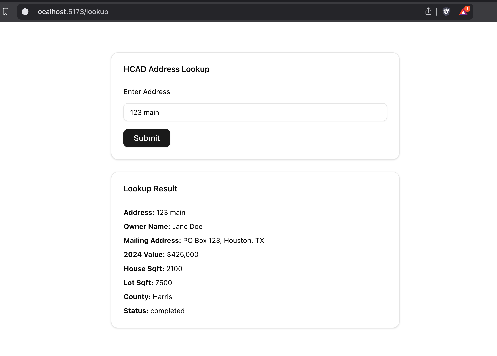

# 🏠 Abode Prep Stack



This project is a full-stack boilerplate for a modern property data lookup and automation service. It's designed for fast prototyping using production-ready technologies like Redis, PostgreSQL, Docker, Prisma, BullMQ, and a modern React + Tailwind frontend.

---

## 🔧 Tech Stack

### Backend

- **Node.js** + **Express** — lightweight REST API
- **Prisma ORM** — type-safe PostgreSQL data modeling
- **PostgreSQL** — primary relational data store
- **Redis + BullMQ** — background job processing
- **Docker Compose** — service orchestration
- **ts-node-dev** — live reload in development

### Frontend

- **Vite** — lightning-fast frontend tooling
- **React + TypeScript**
- **Tailwind CSS** — utility-first styling
- **shadcn/ui** — prebuilt, headless components
- **React Router** — routing

---

## ⚙️ Project Structure

```bash
.
├── backend/                # Express API + background jobs
│   ├── src/
│   │   ├── jobs/           # BullMQ processors
│   │   ├── queues/         # BullMQ queue definitions
│   │   ├── routes/         # API routes
│   │   ├── lib/            # DB and utility clients
│   ├── prisma/             # Prisma schema and migrations
│   └── Dockerfile
│
├── frontend/               # Vite + React + Tailwind app
│   ├── src/pages/          # Pages (e.g., Address Lookup)
│   ├── components/ui/      # Reusable UI components (shadcn)
│   └── index.html
│
├── backend/docker-compose.yml  # Service definitions (Postgres, Redis, Backend, Worker)
```

---

## 🚀 Getting Started

### Prerequisites

- Docker + Docker Compose
- Node.js 18+

### Local Dev Setup

```bash
# Start all containers (Postgres, Redis, Backend, Worker)
docker compose up --build

# Frontend (in separate terminal)
cd frontend
npm install
npm run dev
```

---

## 🧠 Features Demonstrated

- Full-stack job queue integration via Redis and BullMQ
- Background job processing in Dockerized worker
- Prisma for migrations + data access
- React app that submits a job and polls for its result
- Dev-time hot reload for backend via ts-node-dev
- Docker Compose orchestration across services

---

## 🌟 Feature Enhancements (Planned)

These improvements are planned to elevate this project beyond a simple boilerplate:

- **Frontend Address Validation**  
  Implement client-side checks to ensure users submit well-formed, complete street addresses.

- **Backend Address Validation**  
  Add server-side validation and normalization to catch malformed or unsupported addresses before job processing.

- **Frontend Address Autocomplete**  
  Integrate Google Places or a free autocomplete API to assist users with typing and selecting valid addresses faster.

- **Backend Real-Time HCAD Scraper**  
  Replace the mock result generator with a real web scraper or API integration that fetches live appraisal data from the HCAD website.

- **Admin Dashboard for Lookup Monitoring**  
  Build a secure admin UI to view, filter, and debug address lookup history — including job statuses and errors.

---

## 📬 Example Use Case

A user submits an address to look up public data (e.g. HCAD in Houston). A background job queues the request, does a simulated lookup, and stores the result. The frontend polls for the status and displays the final result in a responsive UI.

---

## 👨‍💻 Author

Built by Ade Bello — Senior Software Engineer

---
